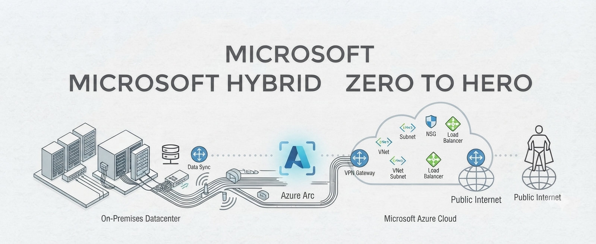

  

 

# Microsoft Hybrid Cloud — Zero to Hero

### ☁️ From on-premises infrastructure to modern Microsoft hybrid cloud — comprehensive explanations, hands-on labs, troubleshooting, automation, and real-world architecture.

---

## 📖 About This Repository

**Microsoft Hybrid Cloud Zero to Hero** is a structured, project-based learning repository designed to take you from the fundamentals of IT infrastructure all the way through building, managing, securing, and automating modern Microsoft hybrid cloud environments.

The learning journey starts with **networking and Windows Server fundamentals**, progresses through **DNS, DHCP, Active Directory, Group Policy, file and storage services, Hyper-V, PowerShell, and advanced Active Directory administration**, and then connects these on-premises technologies with **Microsoft Azure, Microsoft Entra ID, and Microsoft 365**.

The repository also covers modern Microsoft security and endpoint technologies including **Microsoft Intune, Microsoft Defender, Microsoft Purview, Zero Trust, and Microsoft Graph**.

Every section is organized into its own folder with a dedicated `README.md` containing detailed explanations, architecture diagrams, configuration walkthroughs, verification steps, troubleshooting scenarios, and hands-on labs.

The content progresses logically from **on-premises infrastructure → hybrid identity → cloud administration → Microsoft 365 → security → automation**.

By the end of this course, you will be able to:

- ✅ Understand core IT infrastructure, networking, virtualization, and server concepts
- ✅ Deploy and administer Windows Server environments
- ✅ Configure and troubleshoot DNS and DHCP services
- ✅ Build and manage Active Directory Domain Services environments
- ✅ Create and manage users, groups, computers, OUs, and domain controllers
- ✅ Implement centralized administration using Group Policy
- ✅ Configure and manage file servers, NTFS permissions, SMB shares, and storage
- ✅ Build virtualization environments using Hyper-V
- ✅ Understand AD replication, Sites and Services, Global Catalog, FSMO roles, and SYSVOL
- ✅ Implement Windows Server security, certificates, auditing, backup, and recovery
- ✅ Automate infrastructure administration using PowerShell
- ✅ Deploy and manage Azure resources and networking
- ✅ Implement identity and access management using Microsoft Entra ID
- ✅ Configure MFA, SSPR, Conditional Access, Enterprise Applications, SSO, PIM, and Identity Governance
- ✅ Connect on-premises Active Directory with Microsoft Entra ID using hybrid identity technologies
- ✅ Administer Microsoft 365 users, groups, licensing, and tenant settings
- ✅ Manage Exchange Online, SharePoint Online, OneDrive, and Microsoft Teams
- ✅ Manage devices and applications using Microsoft Intune
- ✅ Protect identities, endpoints, email, and cloud workloads using Microsoft Defender
- ✅ Implement data protection and compliance using Microsoft Purview
- ✅ Apply Zero Trust security principles across hybrid environments
- ✅ Automate Microsoft 365 and Entra administration using Microsoft Graph and PowerShell
- ✅ Design and troubleshoot real-world Microsoft hybrid cloud architectures

---

## 📚 Table of Contents

### 1. IT Infrastructure Fundamentals

This section introduces the foundations of enterprise IT infrastructure, including client-server architecture, on-premises environments, virtualization, storage, and enterprise infrastructure components.

📂 **[Explore → IT Infrastructure Fundamentals](./01%20-%20IT%20Infrastructure%20Fundamentals/)**

| # | Sub-Topic | Description |
|---|-----------|-------------|
| 1.1 | Client-Server Architecture | Understanding clients, servers, services, and enterprise applications |
| 1.2 | On-Premises Infrastructure | Understanding traditional enterprise infrastructure |
| 1.3 | Enterprise Infrastructure Components | Servers, storage, networking, applications, and services |
| 1.4 | Virtualization Fundamentals | Understanding virtual machines and virtualization |
| 1.5 | Storage Fundamentals | Disk, volumes, partitions, RAID, and storage concepts |
| 1.6 | Infrastructure Management | Monitoring, administration, documentation, and maintenance |

---

### 2. Networking Fundamentals

This section builds the networking foundation required for Windows Server, Active Directory, Azure, and hybrid cloud environments.

📂 **[Explore → Networking Fundamentals](./02%20-%20Networking%20Fundamentals/)**

| # | Sub-Topic | Description |
|---|-----------|-------------|
| 2.1 | OSI Model | Understanding the seven layers of networking |
| 2.2 | TCP/IP Model | Understanding modern networking architecture |
| 2.3 | IPv4 Addressing | Public, private, network, host, and broadcast addresses |
| 2.4 | Subnetting | CIDR, subnet masks, and subnet calculations |
| 2.5 | TCP and UDP | Understanding transport protocols |
| 2.6 | Ports and Protocols | Common enterprise networking ports and services |
| 2.7 | Routing Fundamentals | Static routing and routing concepts |
| 2.8 | NAT | Network Address Translation |
| 2.9 | Firewalls | Network filtering and traffic control |
| 2.10 | Network Troubleshooting | Ping, tracert, nslookup, Test-NetConnection, and troubleshooting |

---

### 3. Windows Server

This section introduces Windows Server administration and the core tools used to manage enterprise Windows infrastructure.

📂 **[Explore → Windows Server](./03%20-%20Windows%20Server/)**

| # | Sub-Topic | Description |
|---|-----------|-------------|
| 3.1 | Windows Server Fundamentals | Windows Server architecture and editions |
| 3.2 | Windows Server Installation | Installing and configuring Windows Server |
| 3.3 | Server Manager | Managing server roles and features |
| 3.4 | Server Core | Managing Windows Server without a GUI |
| 3.5 | Windows Services | Managing and troubleshooting services |
| 3.6 | Event Viewer | Monitoring and analyzing Windows events |
| 3.7 | Windows Firewall | Configuring Windows Defender Firewall |
| 3.8 | Local Users and Groups | Managing local accounts and permissions |
| 3.9 | Windows Server Administration | Common administration and troubleshooting tasks |

---

### 4. DNS and DHCP

This section covers the core network services required for Windows and Active Directory environments.

📂 **[Explore → DNS and DHCP](./04%20-%20DNS%20and%20DHCP/)**

| # | Sub-Topic | Description |
|---|-----------|-------------|
| 4.1 | DNS Fundamentals | Understanding name resolution |
| 4.2 | DNS Zones | Forward and reverse lookup zones |
| 4.3 | DNS Records | A, AAAA, CNAME, MX, PTR, and SRV records |
| 4.4 | DNS Forwarders | Configuring external name resolution |
| 4.5 | Dynamic DNS | Understanding DDNS |
| 4.6 | DHCP Fundamentals | Understanding automatic IP configuration |
| 4.7 | DHCP Scopes | Creating and managing scopes |
| 4.8 | DHCP Reservations | Assigning predictable IP addresses |
| 4.9 | DHCP Options | Gateway, DNS, domain, and other options |
| 4.10 | DNS/DHCP Troubleshooting | Diagnosing common DNS and DHCP issues |

---

### 5. Active Directory Domain Services

This section introduces Active Directory Domain Services and the core concepts required for enterprise identity and Windows domain administration.

📂 **[Explore → Active Directory Domain Services](./05%20-%20Active%20Directory%20Domain%20Services/)**

| # | Sub-Topic | Description |
|---|-----------|-------------|
| 5.1 | AD DS Fundamentals | Understanding Active Directory |
| 5.2 | Domains | Understanding Windows domains |
| 5.3 | Trees and Forests | Understanding AD forest architecture |
| 5.4 | Domain Controllers | Installing and managing Domain Controllers |
| 5.5 | Organizational Units | Designing and managing OUs |
| 5.6 | Users | Creating and managing domain users |
| 5.7 | Groups | Security and distribution groups |
| 5.8 | Computers | Managing domain-joined computers |
| 5.9 | Domain Join | Joining Windows clients to a domain |
| 5.10 | Authentication | Windows authentication fundamentals |
| 5.11 | LDAP and Global Catalog | Understanding directory queries and GC |
| 5.12 | Service Accounts | Managing accounts used by services |
| 5.13 | Delegation | Delegating administrative permissions |
| 5.14 | AD Recycle Bin | Recovering deleted AD objects |

---

### 6. Group Policy

This section covers centralized configuration and security management using Group Policy.

📂 **[Explore → Group Policy](./06%20-%20Group%20Policy/)**

| # | Sub-Topic | Description |
|---|-----------|-------------|
| 6.1 | Group Policy Fundamentals | Understanding GPO architecture |
| 6.2 | Creating GPOs | Creating and managing Group Policy Objects |
| 6.3 | GPO Linking | Linking policies to domains and OUs |
| 6.4 | User Configuration | Managing user settings |
| 6.5 | Computer Configuration | Managing computer settings |
| 6.6 | GPO Inheritance | Understanding policy inheritance |
| 6.7 | Security Filtering | Controlling GPO application |
| 6.8 | Enterprise Policies | Password, firewall, update, and security policies |
| 6.9 | Drive Mapping | Deploying network drives |
| 6.10 | GPO Troubleshooting | gpupdate, gpresult, RSOP, and troubleshooting |

---

### 7. File and Storage Services

This section covers Windows file servers, SMB, NTFS permissions, shares, and enterprise storage administration.

📂 **[Explore → File and Storage Services](./07%20-%20File%20and%20Storage%20Services/)**

| # | Sub-Topic | Description |
|---|-----------|-------------|
| 7.1 | File Server Fundamentals | Understanding Windows file servers |
| 7.2 | SMB | Server Message Block |
| 7.3 | File Shares | Creating and managing network shares |
| 7.4 | NTFS Permissions | File and folder permissions |
| 7.5 | Share Permissions | Configuring share-level permissions |
| 7.6 | Effective Permissions | Understanding combined permissions |
| 7.7 | Storage Management | Disks, volumes, and storage management |
| 7.8 | File Server Security | Securing enterprise file services |

---

### 8. Hyper-V and Virtualization

This section introduces virtualization using Hyper-V and prepares the environment used for the hands-on labs.

📂 **[Explore → Hyper-V and Virtualization](./08%20-%20Hyper-V%20and%20Virtualization/)**

| # | Sub-Topic | Description |
|---|-----------|-------------|
| 8.1 | Virtualization Fundamentals | Understanding virtualization |
| 8.2 | Hyper-V | Microsoft Hyper-V architecture |
| 8.3 | Virtual Machines | Creating and managing VMs |
| 8.4 | Virtual Switches | External, internal, and private switches |
| 8.5 | Virtual Disks | VHDX and virtual storage |
| 8.6 | Checkpoints | Managing VM checkpoints |
| 8.7 | VM Networking | Connecting lab machines |
| 8.8 | Lab Environment | Building the progressive Windows Server lab |

---

### 9. PowerShell for Windows Administration

This section teaches PowerShell for Windows Server, Active Directory, DNS, DHCP, automation, and enterprise administration.

📂 **[Explore → PowerShell for Windows Administration](./09%20-%20PowerShell%20for%20Windows%20Administration/)**

| # | Sub-Topic | Description |
|---|-----------|-------------|
| 9.1 | PowerShell Fundamentals | Commands, cmdlets, and objects |
| 9.2 | Variables and Data Types | Managing PowerShell data |
| 9.3 | Pipeline | Working with the PowerShell pipeline |
| 9.4 | Conditions and Loops | Automating administrative logic |
| 9.5 | Functions | Creating reusable PowerShell code |
| 9.6 | Filtering and Formatting | Selecting and formatting objects |
| 9.7 | CSV and Reporting | Importing and exporting administrative data |
| 9.8 | Windows Server Administration | Managing Windows Server with PowerShell |
| 9.9 | Active Directory PowerShell | Managing AD using PowerShell |
| 9.10 | DNS and DHCP PowerShell | Automating network services |
| 9.11 | PowerShell Remoting | Remote administration |
| 9.12 | Automation Labs | Real-world Windows administration automation |

---

### 10. Active Directory Advanced Concepts

This section covers advanced Active Directory architecture, replication, domain controllers, and enterprise design.

📂 **[Explore → Active Directory Advanced Concepts](./10%20-%20Active%20Directory%20Advanced%20Concepts/)**

| # | Sub-Topic | Description |
|---|-----------|-------------|
| 10.1 | AD Replication | Understanding directory replication |
| 10.2 | Sites and Services | Designing AD sites |
| 10.3 | Global Catalog | Understanding Global Catalog servers |
| 10.4 | FSMO Roles | Understanding and managing FSMO roles |
| 10.5 | SYSVOL | Understanding SYSVOL |
| 10.6 | DFSR | SYSVOL replication using DFSR |
| 10.7 | Domain Controller Management | Managing multiple DCs |
| 10.8 | AD Troubleshooting | Diagnosing replication and authentication issues |

---

### 11. Windows Server Security

This section covers security hardening and protection of Windows Server environments.

📂 **[Explore → Windows Server Security](./11%20-%20Windows%20Server%20Security/)**

| # | Sub-Topic | Description |
|---|-----------|-------------|
| 11.1 | Windows Security Fundamentals | Windows security architecture |
| 11.2 | Microsoft Defender | Endpoint protection fundamentals |
| 11.3 | Windows Firewall | Host-based firewall security |
| 11.4 | Security Policies | Local and domain security policies |
| 11.5 | Auditing | Windows security auditing |
| 11.6 | Least Privilege | Administrative privilege management |
| 11.7 | Server Hardening | Enterprise server hardening |
| 11.8 | Security Labs | Practical Windows security scenarios |

---

### 12. Backup and Recovery

This section introduces backup, recovery, Active Directory recovery, and disaster recovery concepts.

📂 **[Explore → Backup and Recovery](./12%20-%20Backup%20and%20Recovery/)**

| # | Sub-Topic | Description |
|---|-----------|-------------|
| 12.1 | Backup Fundamentals | Backup strategies and concepts |
| 12.2 | Windows Server Backup | Configuring Windows Server Backup |
| 12.3 | System State Backup | Protecting Windows system state |
| 12.4 | Active Directory Recovery | Recovering AD components |
| 12.5 | File Recovery | Recovering files and folders |
| 12.6 | Disaster Recovery | Enterprise recovery planning |
| 12.7 | Recovery Labs | Practical backup and recovery scenarios |

---

### 13. Hybrid Identity

This section connects on-premises Active Directory with Microsoft cloud identity services. Detailed Microsoft Entra ID concepts are covered separately in the dedicated Entra ID learning path.

📂 **[Explore → Hybrid Identity](./13%20-%20Hybrid%20Identity/)**

| # | Sub-Topic | Description |
|---|-----------|-------------|
| 13.1 | Hybrid Identity Fundamentals | Understanding hybrid identity architecture |
| 13.2 | Microsoft Entra Connect | Connecting on-premises AD with cloud identity |
| 13.3 | Microsoft Entra Cloud Sync | Lightweight directory synchronization |
| 13.4 | Password Hash Synchronization | Understanding PHS |
| 13.5 | Pass-through Authentication | Understanding PTA |
| 13.6 | Federation Concepts | Understanding federated authentication |
| 13.7 | User Principal Name | UPN and identity synchronization |
| 13.8 | Hybrid Join | Understanding hybrid device identity |
| 13.9 | Synchronization Troubleshooting | Diagnosing synchronization problems |
| 13.10 | Hybrid Identity Lab | Building an on-premises to cloud identity environment |

---

### 14. Microsoft 365 Administration

This section introduces Microsoft 365 administration and the core management concepts required for enterprise environments.

📂 **[Explore → Microsoft 365 Administration](./14%20-%20Microsoft%20365%20Administration/)**

| # | Sub-Topic | Description |
|---|-----------|-------------|
| 14.1 | Microsoft 365 Fundamentals | Understanding Microsoft 365 |
| 14.2 | Microsoft 365 Admin Center | Central administration |
| 14.3 | Users | Managing Microsoft 365 users |
| 14.4 | Groups | Microsoft 365 and security groups |
| 14.5 | Licensing | Managing service licenses |
| 14.6 | Domains | Adding and managing domains |
| 14.7 | Service Health | Monitoring Microsoft 365 services |
| 14.8 | Administration Labs | Practical Microsoft 365 administration |

---

### 15. Exchange Online

This section covers Exchange Online administration, mailboxes, mail flow, messaging policies, and troubleshooting.

📂 **[Explore → Exchange Online](./15%20-%20Exchange%20Online/)**

| # | Sub-Topic | Description |
|---|-----------|-------------|
| 15.1 | Exchange Online Fundamentals | Understanding cloud email |
| 15.2 | Mailboxes | Creating and managing mailboxes |
| 15.3 | Distribution Groups | Managing distribution groups |
| 15.4 | Mail Flow | Understanding message delivery |
| 15.5 | Mail Flow Rules | Creating transport rules |
| 15.6 | Connectors | Configuring mail connectors |
| 15.7 | Message Trace | Troubleshooting email delivery |
| 15.8 | Exchange Online Protection | Email security fundamentals |
| 15.9 | Exchange Labs | Practical messaging administration |

---

### 16. SharePoint Online and OneDrive

This section covers collaboration, document management, permissions, sharing, and OneDrive administration.

📂 **[Explore → SharePoint Online and OneDrive](./16%20-%20SharePoint%20Online%20and%20OneDrive/)**

| # | Sub-Topic | Description |
|---|-----------|-------------|
| 16.1 | SharePoint Fundamentals | Understanding SharePoint Online |
| 16.2 | Sites | Creating and managing sites |
| 16.3 | Permissions | Managing SharePoint access |
| 16.4 | Sharing | Internal and external sharing |
| 16.5 | OneDrive Fundamentals | Understanding personal cloud storage |
| 16.6 | OneDrive Sync | Configuring synchronization |
| 16.7 | External Sharing | Managing external collaboration |
| 16.8 | SharePoint and OneDrive Labs | Practical collaboration scenarios |

---

### 17. Microsoft Teams

This section covers Microsoft Teams administration and enterprise collaboration.

📂 **[Explore → Microsoft Teams](./17%20-%20Microsoft%20Teams/)**

| # | Sub-Topic | Description |
|---|-----------|-------------|
| 17.1 | Teams Fundamentals | Understanding Microsoft Teams |
| 17.2 | Teams and Channels | Creating teams and channels |
| 17.3 | Team Permissions | Managing team membership |
| 17.4 | Guest Access | External guest collaboration |
| 17.5 | External Access | External communication |
| 17.6 | Teams Policies | Managing Teams policies |
| 17.7 | Meetings | Meeting administration |
| 17.8 | Teams Labs | Practical Teams administration |

---

### 18. Microsoft Intune

This section introduces cloud-based endpoint management, device enrollment, configuration, compliance, applications, and Windows Autopilot.

📂 **[Explore → Microsoft Intune](./18%20-%20Microsoft%20Intune/)**

| # | Sub-Topic | Description |
|---|-----------|-------------|
| 18.1 | Intune Fundamentals | Understanding endpoint management |
| 18.2 | Device Enrollment | Enrolling devices into Intune |
| 18.3 | Configuration Profiles | Managing device configurations |
| 18.4 | Compliance Policies | Defining device compliance |
| 18.5 | Application Management | Deploying applications |
| 18.6 | Windows Autopilot | Modern Windows deployment |
| 18.7 | Endpoint Security | Managing endpoint security policies |
| 18.8 | Intune Labs | Practical endpoint management |

---

### 19. Microsoft Defender

This section introduces Microsoft's security ecosystem for identity, endpoints, email, and extended detection and response.

📂 **[Explore → Microsoft Defender](./19%20-%20Microsoft%20Defender/)**

| # | Sub-Topic | Description |
|---|-----------|-------------|
| 19.1 | Microsoft Defender Fundamentals | Understanding Microsoft Defender |
| 19.2 | Defender for Office 365 | Email and collaboration protection |
| 19.3 | Defender for Endpoint | Endpoint detection and protection |
| 19.4 | Defender for Identity | Protecting Active Directory identities |
| 19.5 | Microsoft Defender XDR | Extended detection and response |
| 19.6 | Incidents and Alerts | Investigating security incidents |
| 19.7 | Threat Hunting | Basic threat hunting concepts |
| 19.8 | Security Operations | SOC-oriented security workflows |
| 19.9 | Defender Labs | Practical security scenarios |

---

### 20. Microsoft Purview

This section introduces data security, compliance, information protection, retention, DLP, and eDiscovery.

📂 **[Explore → Microsoft Purview](./20%20-%20Microsoft%20Purview/)**

| # | Sub-Topic | Description |
|---|-----------|-------------|
| 20.1 | Purview Fundamentals | Understanding Microsoft Purview |
| 20.2 | Sensitivity Labels | Protecting sensitive information |
| 20.3 | Data Loss Prevention | Preventing data leakage |
| 20.4 | Retention | Managing data retention |
| 20.5 | eDiscovery | Discovering organizational data |
| 20.6 | Insider Risk | Understanding insider risk management |
| 20.7 | Compliance Management | Managing Microsoft 365 compliance |
| 20.8 | Purview Labs | Practical compliance scenarios |

---

### 21. Zero Trust

This section introduces the Zero Trust security model and how identity, devices, applications, and data are protected in modern hybrid environments.

📂 **[Explore → Zero Trust](./21%20-%20Zero%20Trust/)**

| # | Sub-Topic | Description |
|---|-----------|-------------|
| 21.1 | Zero Trust Fundamentals | Understanding the Zero Trust model |
| 21.2 | Verify Explicitly | Identity and access verification |
| 21.3 | Least Privilege | Limiting access |
| 21.4 | Assume Breach | Designing for compromised environments |
| 21.5 | Identity Security | Protecting identities |
| 21.6 | Device Security | Protecting endpoints |
| 21.7 | Application Security | Securing applications |
| 21.8 | Data Security | Protecting organizational data |
| 21.9 | Zero Trust Architecture | Designing a Zero Trust environment |
| 21.10 | Zero Trust Labs | Practical security scenarios |

---

### 22. Microsoft Graph and Automation

This section introduces Microsoft Graph and automation techniques for managing Microsoft cloud services programmatically.

📂 **[Explore → Microsoft Graph and Automation](./22%20-%20Microsoft%20Graph%20and%20Automation/)**

| # | Sub-Topic | Description |
|---|-----------|-------------|
| 22.1 | Microsoft Graph Fundamentals | Understanding Microsoft Graph |
| 22.2 | Graph Explorer | Exploring Microsoft Graph APIs |
| 22.3 | Graph PowerShell | Managing Microsoft services with PowerShell |
| 22.4 | API Authentication | Understanding application authentication |
| 22.5 | User Automation | Automating user administration |
| 22.6 | Group Automation | Automating group management |
| 22.7 | Bulk Administration | Managing large environments |
| 22.8 | Automation Projects | Building practical automation solutions |

---

### 23. Troubleshooting

This section provides practical troubleshooting scenarios across networking, Windows Server, Active Directory, Group Policy, hybrid identity, and Microsoft 365.

📂 **[Explore → Troubleshooting](./23%20-%20Troubleshooting/)**

| # | Sub-Topic | Description |
|---|-----------|-------------|
| 23.1 | Network Troubleshooting | Diagnosing connectivity and routing issues |
| 23.2 | DNS Troubleshooting | Diagnosing name resolution problems |
| 23.3 | DHCP Troubleshooting | Diagnosing IP assignment problems |
| 23.4 | Windows Server Troubleshooting | Services, events, firewall, and system issues |
| 23.5 | Active Directory Troubleshooting | Authentication and domain issues |
| 23.6 | Replication Troubleshooting | Diagnosing AD replication failures |
| 23.7 | Group Policy Troubleshooting | Diagnosing GPO application issues |
| 23.8 | File Server Troubleshooting | Permissions and SMB problems |
| 23.9 | Hybrid Identity Troubleshooting | Diagnosing synchronization problems |
| 23.10 | Microsoft 365 Troubleshooting | Common cloud administration issues |
| 23.11 | Enterprise Troubleshooting Scenarios | Real-world infrastructure problems |

---

### 24. Enterprise Projects

This final section combines the technologies learned throughout the repository into realistic enterprise infrastructure projects.

📂 **[Explore → Enterprise Projects](./24%20-%20Enterprise%20Projects/)**

| # | Project | Description |
|---|---------|-------------|
| 24.1 | On-Premises Enterprise | Build a complete Windows Server enterprise environment |
| 24.2 | Secure Enterprise Environment | Implement enterprise security and hardening |
| 24.3 | Multi-Site Active Directory | Design and deploy a multi-site AD environment |
| 24.4 | Enterprise PowerShell Automation | Automate Windows and AD administration |
| 24.5 | Hybrid Identity Environment | Connect on-premises AD with Microsoft cloud identity |
| 24.6 | Microsoft 365 Enterprise | Deploy and administer Microsoft 365 services |
| 24.7 | Modern Endpoint Management | Manage Windows devices using Intune |
| 24.8 | Microsoft Security Environment | Implement Defender security capabilities |
| 24.9 | Data Protection and Compliance | Implement Purview security and compliance |
| 24.10 | Complete Hybrid Cloud | Build an end-to-end hybrid Microsoft environment |
| 24.11 | Final Capstone Project | Integrate infrastructure, identity, management, security, and automation |

---

## 🤝 Contributing

Contributions are welcome!

If you have suggestions for improvements, new examples, better explanations, or find any issues, feel free to:

- Open an issue
- Submit a pull request
- Improve existing documentation
- Add useful examples or diagrams

Please keep contributions beginner-friendly, accurate, and consistent with the structure of this repository.

---

**Happy Hybrid Infra Building! ☁️**

*If this repo helped you, please consider giving it a ⭐*

